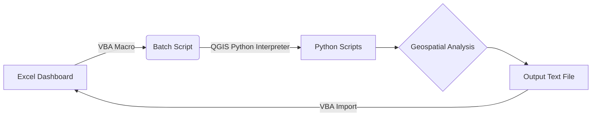

# [Project Name]: Geospatial Pipeline Analysis Automation

**Automated QGIS geospatial analysis integrated with Excel for oil/gas pipeline route evaluation**  
*Developed for [Consultancy Startup Name] to streamline pipeline planning and compliance checks.*

---

## 📌 Overview
This project automates geospatial analysis for pipeline routes using **QGIS**, **Python**, and **Excel VBA**. It calculates critical metrics (length, elevation, crossings, soil composition) and integrates results into an Excel dashboard for non-technical users. Key components:
- **QGIS Python Scripts**: Geospatial calculations (pipelines, rivers, roads, DEM, soil data).
- **Batch Automation**: Headless execution of QGIS scripts.
- **Excel VBA Dashboard**: One-click execution and result visualization.

---

## ⚙️ Features
- **Geospatial Analysis (QGIS/Python):**
  - Pipeline length extraction.
  - Elevation profile generation.
  - Count of river/road crossings.
  - Soil composition analysis along the route.
- **Automation:**
  - Batch scripts to run QGIS Python scripts outside the GUI.
  - Excel VBA macros to trigger workflows and import results.
- **User-Friendly Dashboard:**
  - Excel buttons to execute analysis.
  - Auto-populated results in formatted cells.

---

## 🔄 Workflow


---

## 🛠️ Installation
### Dependencies
1. **QGIS 3.x** ([Download](https://qgis.org))
2. **Microsoft Excel** (with VBA enabled)
3. **Python 3.x** (with packages: `pandas`, `openpyxl`, `qgis.core`)

### Setup
1. Clone this repository:
   ```bash
   git clone https://github.com/[your-username]/[project-name].git
   ```
2. Configure QGIS Python environment:
   - Update paths in `run_analysis.bat` to match your QGIS installation.
3. Enable Excel Macros:
   - Go to `File > Options > Trust Center > Macro Settings > Enable all macros`.

---

## 🚀 Usage
1. **Prepare Input Data:**
   - Place pipeline/river/road shapefiles in `data/input/`.
   - Add DEM and soil raster files to `data/raster/`.
2. **Run Analysis:**
   - Open `Pipeline_Analysis_Dashboard.xlsm`.
   - Click **Run Analysis** button to execute scripts.
3. **View Results:**
   - Metrics populate in the **Results** sheet.
   - Check `logs/output.log` for detailed reports.

---

## 📂 File Structure
```
├── data/
│   ├── input/           # Shapefiles (pipelines, rivers, roads)
│   └── raster/          # DEM and soil data
├── scripts/
│   ├── qgis_scripts/    # Python scripts for QGIS analysis
│   ├── batch/           # .bat files for automation
│   └── vba/             # Excel macro code
├── logs/                # Execution logs
├── Pipeline_Analysis_Dashboard.xlsm
└── README.md
```

---

## 🔍 Code Snippets
### Batch Script (Example)
```batch
@echo off
SET OSGEO4W_ROOT=C:\Program Files\QGIS 3.x
call "%OSGEO4W_ROOT%\bin\o4w_env.bat"
python scripts/qgis_scripts/pipeline_analysis.py
```

### Excel VBA Macro (Example)
```vba
Sub RunAnalysis()
    Dim batchPath As String
    batchPath = ThisWorkbook.Path & "\scripts\batch\run_analysis.bat"
    Shell Environ("COMSPEC") & " /c """ & batchPath & """", vbHide
    MsgBox "Analysis completed! Results updated."
End Sub
```

---

## 🤝 Contributing
1. Fork the repository.
2. Create a branch (`git checkout -b feature/improvement`).
3. Commit changes (`git commit -m 'Add new feature'`).
4. Push to the branch (`git push origin feature/improvement`).
5. Open a Pull Request.

---

## 📄 License
This project is licensed under the [MIT License](LICENSE).

---

*Developed by [Your Name] | [LinkedIn/GitHub Profile Link]*
