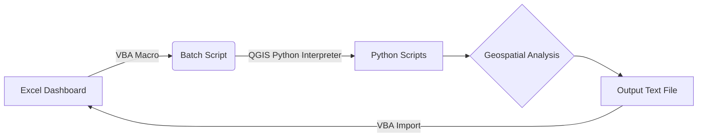

# Geospatial Pipeline Analysis Automation

**Automated QGIS geospatial analysis integrated with Excel for oil/gas pipeline route evaluation**  
*Developed for Digital Transformatin and Engineering Consultancy Ltd to streamline pipeline planning and compliance checks.*

---

## 📌 Overview
This project automates geospatial analysis for pipeline routes using **QGIS**, **Python**, and **Excel VBA**. It calculates critical metrics (length, elevation, crossings, soil composition) and integrates results into an Excel dashboard for non-technical users. Key components:
- **QGIS Python Scripts**: Geospatial calculations (pipelines, rivers, roads, DEM, soil data).
- **Batch Automation**: Headless execution of QGIS scripts.
- **Excel VBA Dashboard**: One-click execution and result visualization.

---

## ⚙️ Features
- **Geospatial Analysis (QGIS/Python):**
  - Pipeline length extraction.
  - Elevation profile generation.
  - Count of river/road crossings.
  - Soil composition analysis along the route.
- **Automation:**
  - Batch scripts to run QGIS Python scripts outside the GUI.
  - Excel VBA macros to trigger workflows and import results.
- **User-Friendly Dashboard:**
  - Excel buttons to execute analysis.
  - Auto-populated results in formatted cells.

---

## 🔄 Workflow

---

## 🛠️ Installation
### Dependencies
1. **QGIS 3.22** ([Download](https://qgis.org))
2. **Microsoft Excel** (with VBA enabled)
3. **Python 3.10** (with packages: `pandas`, 'GDAL/OGR', 'PyQGIS', 'GeoPandas', 'Shapely', 'Fiona', 'Rasterio', 'PyQt5', 'OpenPyXL')

---
